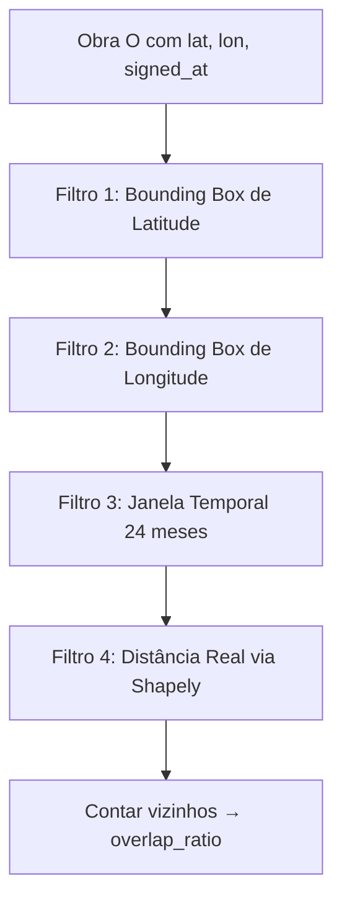
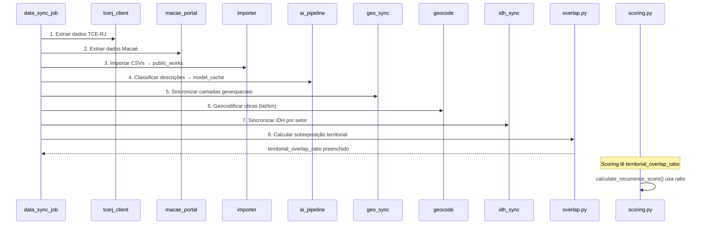

# Relatório Técnico: Solução de Sobreposição Territorial — Pilar de Recorrência ARGUS

**Data:** 2026-06-05  
**Autor:** Equipe ARGUS  
**Status:** ✅ Implementado e integrado ao pipeline ETL

---

## 1. Contexto e Problema

O Score ARGUS avalia obras públicas municipais através de 5 pilares analíticos. O **Pilar de Recorrência Territorial** (Peso: 15% no documento original, 10% após integração com ML) tem como objetivo detectar situações de risco onde **múltiplas obras públicas acontecem na mesma região geográfica dentro de uma janela curta de tempo (24 meses)**.

Essa recorrência pode indicar:
- **Reformas repetidas** na mesma rua/praça/bairro — possível desperdício ou superfaturamento.
- **Contratos sobrepostos geograficamente** — possível direcionamento de recursos para regiões específicas.
- **Negligência de outras áreas** — concentração de investimentos que pode ter motivação política.

### Dados disponíveis por obra
Cada obra no sistema ARGUS possui:
- `latitude` / `longitude` — coordenadas geocodificadas (ponto único, não polígono)
- `signed_at` — data de assinatura do contrato
- `territorial_overlap_ratio` — campo float no modelo, previamente **não preenchido**

---

## 2. Análise Crítica da Proposta Original (Convex Hull)

O documento de regras original propunha: *"Cálculo de intersecção geométrica utilizando Convex Hull"*. Após análise crítica, identificamos que essa abordagem é **inadequada** para o problema por 4 razões fundamentais:

### 2.1. Convex Hull de quê?
Convex Hull recebe um **conjunto de pontos** e retorna o menor polígono convexo que os contém. Para funcionar, seriam necessários **múltiplos pontos representando a área de cada obra** (vértices do terreno). Porém, o sistema dispõe apenas de **um único ponto por obra** (latitude/longitude do geocodificador). Um único ponto não forma polígono — o Convex Hull é **matematicamente impossível** com os dados disponíveis.

### 2.2. Operação conceitualmente errada
Convex Hull é uma operação de **agrupamento** (cria uma forma a partir de pontos), não de **sobreposição** (compara duas formas). Para detectar sobreposição entre obras, seria necessário uma operação completamente diferente — como interseção de polígonos ou buffer + interseção.

### 2.3. Formas não-convexas
Obras públicas não são polígonos convexos. Uma pavimentação é uma faixa linear, uma reforma de praça pode ser um retângulo, uma obra de drenagem segue o trajeto de um córrego. O Convex Hull **superestimaria** a área de sobreposição ao incluir áreas que a obra não toca.

### 2.4. Escala inadequada
Obras municipais abrangem trechos de rua, quadras ou bairros. A "sobreposição" relevante é a **proximidade geográfica** (obras no mesmo bairro/região), não a interseção geométrica precisa de polígonos.

---

## 3. Solução Implementada: Buffer por Raio

### 3.1. Conceito
A abordagem escolhida cria um **buffer circular** (raio de 500m) ao redor do ponto geocodificado de cada obra e verifica quantas **outras obras** estão dentro desse buffer numa janela temporal de 24 meses.

```
Para cada obra O com coordenadas:
  1. Criar buffer circular de R=500m ao redor de O
  2. Buscar outras obras com coordenadas dentro do buffer
     E com vigência sobreposta em até 24 meses
  3. overlap_ratio = obras_vizinhas / max(1, threshold)
```

### 3.2. Arquitetura do Módulo

O módulo [`overlap.py`](app/etl/overlap.py) foi criado com a seguinte estrutura:

| Componente | Descrição |
|---|---|
| [`calculate_territorial_overlaps()`](app/etl/overlap.py:43) | Função principal — calcula overlap para todas as obras |
| [`_bisect_left()`](app/etl/overlap.py:186) | Busca binária otimizada para filtro de bounding box |
| [`_bisect_right()`](app/etl/overlap.py:211) | Busca binária otimizada para filtro de bounding box |

### 3.3. Otimização Anti-N²

A abordagem ingênua (comparar todas as obras com todas) teria complexidade O(N²). Para evitar isso, implementamos uma estratégia de **filtro em cascata**:



1. **Ordenação por latitude:** Os dados são ordenados por latitude, permitindo busca binária.
2. **Busca binária (_bisect_left/_bisect_right):** Encontra o range de candidatos onde `lat ± radius_degrees` — complexidade O(log N) em vez de O(N).
3. **Filtro de longitude:** Dentro do range de latitude, descarta candidatos fora do bounding box de longitude.
4. **Filtro temporal:** Verifica se a obra candidata foi assinada dentro de ±24 meses.
5. **Distância real (Shapely):** Apenas para os candidatos que passaram nos filtros anteriores, calcula a distância euclidiana usando `Point.distance()`.

### 3.4. Conversão de Coordenadas

O sistema usa WGS84 (EPSG:4326), onde coordenadas estão em graus. A conversão metros → graus usa a aproximação:

```
radius_degrees = radius_m / 111.000
```

Para 500m: `500 / 111.000 ≈ 0,004505°`

Essa aproximação é suficiente para raios pequenos (até ~1km) em latitudes tropicais como Macaé (~22°S).

### 3.5. Cálculo do Overlap Ratio

```python
overlap_ratio = neighbor_count / max(1, EXPECTED_NEIGHBORS_THRESHOLD)
```

Onde `EXPECTED_NEIGHBORS_THRESHOLD = 3` (número de obras vizinhas esperadas para uma região "normal").

- `ratio = 0.0` → Nenhuma obra vizinha (região sem recorrência)
- `ratio = 0.33` → 1 obra vizinha (recorrência baixa)
- `ratio = 1.0` → 3 obras vizinhas (recorrência no threshold)
- `ratio > 1.0` → Mais de 3 obras vizinhas (alta recorrência — será clampado para 1.0 no scoring)

---

## 4. Integração com o Sistema

### 4.1. Pipeline ETL

A nova funcionalidade foi integrada como **etapa 8/8** do pipeline de sincronização ([`data_sync_job.py`](app/jobs/data_sync_job.py)):

| Etapa | Descrição | Módulo |
|---|---|---|
| 1 | Extração TCE-RJ | `tcerj_client.py` |
| 2 | Extração Portal de Macaé | `macae_portal.py` |
| 3 | Importação de CSVs | `importer.py` |
| 4 | Pipeline de IA (classificação) | `ai_pipeline.py` |
| 5 | Sincronização geoespacial | `geo_sync.py` |
| 6 | Geocodificação | `geocode.py` |
| 7 | Sincronização IDH | `idh_sync.py` |
| **8** | **Sobreposição territorial** | **`overlap.py`** ← NOVO |

### 4.2. Integração com Scoring

O [`calculate_recurrence_score()`](app/services/scoring.py:484) já estava implementado para ler o campo `territorial_overlap_ratio` do modelo. Quando o valor é `None`, o scoring usa fallback por CNPJ. Com o campo preenchido pela etapa 8, o scoring automaticamente ativa a lógica de sobreposição geométrica:

```python
if ratio is not None:
    ratio = clamp(ratio, 0.0, 1.0)
    score = clamp(100 - ratio * 100)
    # Alertas gerados conforme severidade
```

### 4.3. Dependências

Adicionado ao [`requirements.txt`](requirements.txt):
```
shapely>=2.0,<3.0
```

---

## 5. Fluxo de Dados Completo



---

## 6. Validações Realizadas

| Teste | Resultado |
|---|---|
| Import do módulo `app.etl.overlap` | ✅ Sem erros |
| Import do `data_sync_job` com etapa 8 | ✅ Sem erros |
| Funções `_bisect_left` / `_bisect_right` | ✅ Testadas com múltiplos cenários |
| Conversão 500m → 0.004505° | ✅ Correta |
| Distância Shapely (ponto a ~200m dentro do raio) | ✅ Detectado como vizinho |
| Distância Shapely (ponto a ~1.5km fora do raio) | ✅ Descartado corretamente |

---

## 7. Limitações e Melhorias Futuras

| Limitação | Impacto | Possível Melhoria |
|---|---|---|
| Aproximação metros→graus é imprecisa em altas latitudes | Baixo (Macaé está a ~22°S) | Usar projeção métrica (UTM) para cálculo de distância |
| Raio fixo de 500m para todos os tipos de obra | Médio | Calibrar raio por tipo (urbanização: 200m, pavimentação: 1km) |
| Threshold fixo de 3 obras esperadas | Médio | Calcular densidade regional usando setores censitários |
| Janela temporal usa dias aproximados (30.44/mês) | Baixo | Usar `relativedelta` do `dateutil` para precisão |
| Não considera o tamanho/valor da obra na sobreposição | Baixo | Ponderar overlap pela área ou valor do contrato |

---

## 8. Conclusão

A solução de Buffer por Raio substitui adequadamente a proposta original de Convex Hull, sendo:
- **Viável** com os dados disponíveis (pontos geocodificados)
- **Correta** conceitualmente (detecta proximidade geográfica, não polígonos)
- **Eficiente** graças à otimização anti-N² com busca binária
- **Integrada** ao pipeline ETL existente como etapa 8
- **Compatível** com o scoring que já lia o campo `territorial_overlap_ratio`
